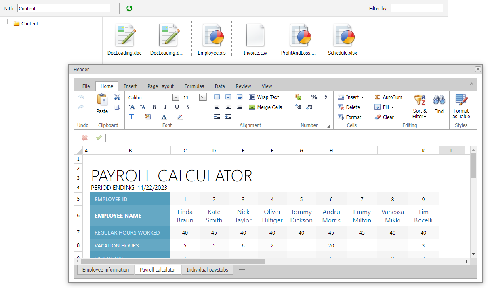

<!-- default badges list -->

[](https://supportcenter.devexpress.com/ticket/details/T318308)
[](https://docs.devexpress.com/GeneralInformation/403183)
<!-- default badges end -->

# File Manager for ASP.NET Web Forms - How to open a selected file
<!-- run online -->
**[[Run Online]](https://codecentral.devexpress.com/t318308/)**
<!-- run online end -->

This example demonstrates how to open a selected file in [ASPxSpreadsheet](https://docs.devexpress.com/AspNet/DevExpress.Web.ASPxSpreadsheet.ASPxSpreadsheet) or [ASPxRichEdit](https://docs.devexpress.com/AspNet/DevExpress.Web.ASPxRichEdit.ASPxRichEdit) component. 



## Implementation Details

In this example, [ASPxFileManager](https://docs.devexpress.com/AspNet/DevExpress.Web.ASPxFileManager) contains files that can be opened in [ASPxSpreadsheet](https://docs.devexpress.com/AspNet/DevExpress.Web.ASPxSpreadsheet.ASPxSpreadsheet) or [ASPxRichEdit](https://docs.devexpress.com/AspNet/DevExpress.Web.ASPxRichEdit.ASPxRichEdit) component. When a user clicks a file, the [ASPxClientFileManager.SelectedFileChanged](https://docs.devexpress.com/AspNet/js-ASPxClientFileManager.SelectedFileChanged) event fires. The event handler shows a popup and sends callback to server.

```jscript
function OnSelectedFileChanged(s, e) {
    if (e.file != null) {
        PopupWithDocument.Show();
        PopupWithDocument.PerformCallback(e.file.GetFullName());
    }
}
```
On the server, the [WindowCallback](https://docs.devexpress.com/AspNet/DevExpress.Web.ASPxPopupControlBase.WindowCallback) event handler determines a format of the selected file and opens the file in the [ASPxSpreadsheet](https://docs.devexpress.com/AspNet/DevExpress.Web.ASPxSpreadsheet.ASPxSpreadsheet) component for [spreadcheet formats](https://docs.devexpress.com/OfficeFileAPI/DevExpress.Spreadsheet.DocumentFormat._members#fields); otherwise the document is opened in the [ASPxRichEdit](https://docs.devexpress.com/AspNet/DevExpress.Web.ASPxRichEdit.ASPxRichEdit) component.

```scharp
protected void PopupWithDocument_WindowCallback(object source, DevExpress.Web.PopupWindowCallbackArgs e) {
String fullFileName = e.Parameter;

object format = DocumentFormatHelper.GetFormat(fullFileName);
if (format == null) return;

Boolean isSpreadsheet = format is DevExpress.Spreadsheet.DocumentFormat;
ASPxSpreadsheet1.Visible = isSpreadsheet;
ASPxRichEdit1.Visible = !isSpreadsheet;

var docId = Guid.NewGuid().ToString();
var docPath =  Server.MapPath(fullFileName);

if (isSpreadsheet)
  ASPxSpreadsheet1.Open(docId, (DevExpress.Spreadsheet.DocumentFormat)format, () => File.ReadAllBytes(docPath));
else
  ASPxRichEdit1.Open(docId, (DevExpress.XtraRichEdit.DocumentFormat)format, () => File.ReadAllBytes(docPath));
}
```

## Files to Review

* [Default.aspx](./CS/Default.aspx) (VB: [Default.aspx](./VB/Default.aspx))
* [Default.aspx.cs](./CS/Default.aspx.cs) (VB: [Default.aspx.vb](./VB/Default.aspx.vb))

## More Examples

* []()
